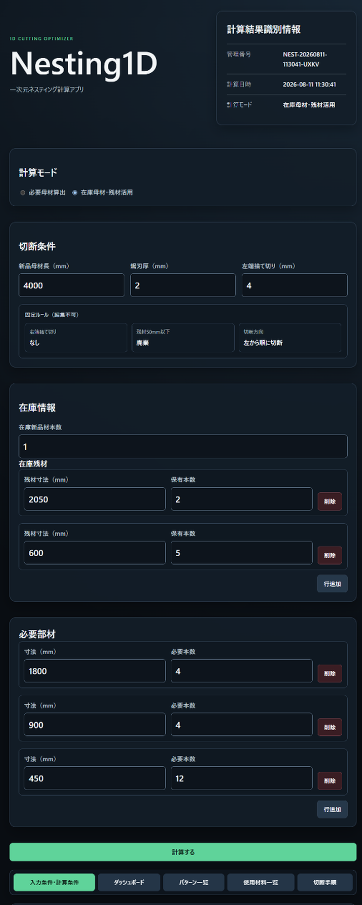
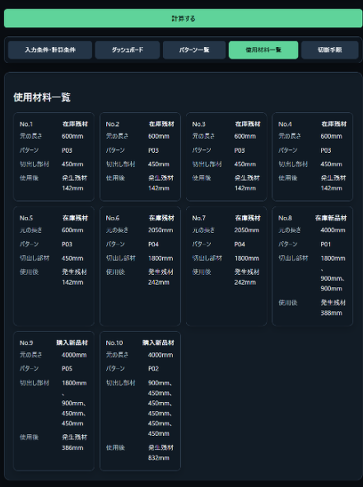
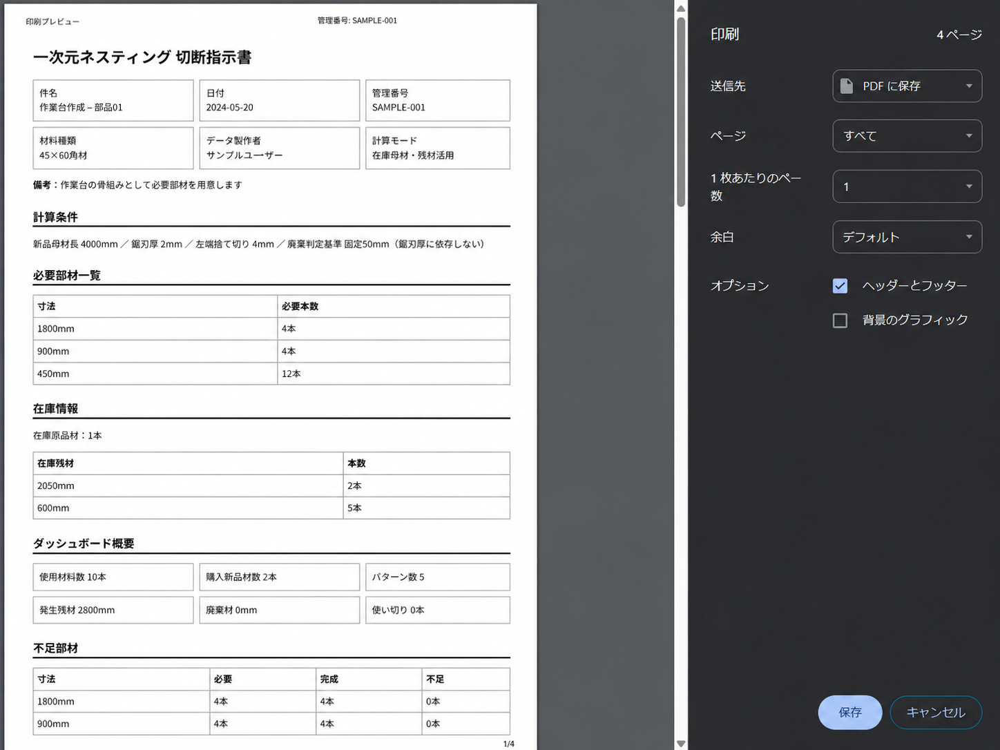

# Nesting1D

1次元材料の切り出しにおいて、材料の無駄を抑えながら、現場で実行しやすい切断計画の作成を支援します。

材料を有効に活用し、作業を分かりやすくすることを目的としています。

Webアプリケーション / V1.0.1

## 目次

- [アプリについて](#アプリについて)
- [特徴](#特徴)
- [技術・設計](#技術設計)
- [テスト・品質](#テスト品質)
- [開発プロセスとAI活用](#開発プロセスとai活用)
- [適用範囲と利用上の注意](#適用範囲と利用上の注意)
- [関連ドキュメント](#関連ドキュメント)
- [ライセンス](#ライセンス)

## アプリについて

<table>
  <tr>
    <td width="62%" valign="top">
      <p>Nesting1Dは、定尺の新品材、在庫新品材、在庫残材から必要な長さの部材を切り出す、一次元ネスティングWebアプリです。丸棒、角材、パイプ、木材など、長さで管理する材料を対象とします。</p>
      <h3>こんなときに使います</h3>
      <ul>
        <li>切り出す寸法や本数が多く、材料への割り付けを考えるのが難しい</li>
        <li>在庫新品材や在庫残材も含めて切断計画を作りたい</li>
        <li>必要となる追加購入新品材の本数を事前に把握したい</li>
        <li>材料見積の補助として、必要な母材本数を確認したい</li>
        <li>現場で実行できる切断順や切断パターンを確認したい</li>
      </ul>
      <h3>基本的な使い方</h3>
      <ol>
        <li>必要部材の寸法と本数を入力します。</li>
        <li>新品母材長、鋸刃厚、左端捨て切り寸法を入力します。</li>
        <li>在庫を活用する場合は、在庫新品材と在庫残材を入力します。</li>
        <li>計算を実行し、切断計画と現場向け切断手順を確認します。</li>
      </ol>
      <p>件名、材料種類、データ製作者、備考などの任意情報も入力できます。入力項目と制約の詳細は<a href="docs/REQUIREMENTS.md">仕様書</a>を参照してください。</p>
    </td>
    <td width="38%" valign="top" align="center">
      
    </td>
  </tr>
</table>

### 計算すると分かること

- 使用する材料と切断パターン
- 材料ごとの切出し寸法と順序
- 在庫新品材・在庫残材の使用状況
- 追加購入する新品材の本数
- 加工後に発生する残材・廃棄材・使い切り
- 現場で確認できる切断手順

計算は現場で実行しやすい計画の作成を支援するものであり、完全な数学的最適解を保証するものではありません。

<p align="center">
  
</p>

### 計算結果の保存

- 計算結果をJSON形式で利用者の端末へ保存できます。
- 保存したJSONをブラウザで読み込み、現在の計算エンジンで再計算できます。
- 入力条件、結果、切断手順を含むHTMLを端末へ保存できます。
- 入力内容、計算結果、JSON、HTML、計算履歴をサーバーへ永続保存しません。

計算結果は現場向けの切断指示書としてHTML出力でき、ブラウザからPDF保存または印刷できます。

<p align="center">
  
</p>

JSON・HTML・APIのデータ契約は[入出力データ契約](docs/INPUT_OUTPUT_SCHEMA.md)を参照してください。

### 利用時の考え方

大量の材料を一度に入力するのではなく、材質、規格、保管場所、作業単位などで整理し、実際に同時使用できる材料ごとに分けて計算します。

## 特徴

### 現場で実行しやすい切断計画

材料の残り長さだけでなく、切断順、切断パターン数、寸法変更回数も候補比較に含めます。同一パターンをまとめ、材料ごとの切断手順として確認できる形で結果を提示します。

### 在庫材・残材を含めて候補を比較

在庫新品材・在庫残材の利用を含む複数の切断候補を比較し、追加購入する新品材の抑制、材料利用、作業性を考慮して計画を選択します。在庫残材を使用する候補と使用しない候補の両方を比較するため、残材を使わない計画が選ばれる場合もあります。

### 見積から現場作業まで利用可能

追加購入新品材数の確認、切断計画の確認、JSON保存、端末JSONからの再計算、現場用HTMLの出力までを一連の操作で行えます。

### 結果の再現性

同じ入力条件、同じアプリバージョン、同じ計算方式では同じ計算結果となるよう、決定的な判定ルールを採用しています。

### 完全最適化より実用性

すべての組合せを調べる完全探索ではありません。複数の貪欲的戦略から候補を生成し、材料利用と作業上の複雑さを段階的に比較することで、入力上限内で実用的な計画を選びます。

## 技術・設計

### 使用技術

- Python 3.11
- FastAPI / Uvicorn
- Pydantic
- Jinja2
- HTML / CSS / JavaScript
- pytest
- Docker / Dev Containers
- Google Cloud Run

### 開発・公開環境

VS CodeとDocker Dev Containersを使用し、開発環境をコンテナ化しています。本番は専用の非rootコンテナをGoogle Cloud Runで実行し、開発環境と分離しています。本番環境ではFastAPIの`/docs`、`/redoc`、`/openapi.json`を公開しません。

### 全体構成

```text
Browser
  ↓
FastAPI
  ↓
Calculation Engine
  ↓
Candidate Generation
  ↓
Candidate Selection
  ↓
Result
  ├─ Web画面
  ├─ JSON
  └─ HTML
```

### プログラム構成

Web/API、計算ロジック、候補生成・選別、HTMLテンプレート、CSS・JavaScript、自動テスト、ドキュメントの責務を分けています。計算処理をWeb/UIや出力処理から分離し、計算単体とWeb経由の双方を検証できる構成です。

### アルゴリズムの思想

必要母材算出モードでは寸法順の異なる2候補、在庫モードでは在庫残材の使用・不使用も組み合わせた4候補を生成します。加重点評価ではなく、必要部材の完全充足、追加購入新品材数、廃棄材・発生残材、作業上の複雑さを順に比較し、最後は決定的な比較で計画を確定します。

詳細は[計算・切断ルール](docs/CALCULATION_RULES.md)、実際の数値例は[計算例](docs/CALCULATION_EXAMPLES.md)を参照してください。

### 設計上の重要ポイント

- 計算処理とWeb/UIの責務を分離
- 決定的な判定による結果の再現性
- 利用者データをサーバーへ永続保存しない構成
- 入力件数・数値範囲・HTTPリクエスト本文の制限
- 開発環境と本番環境の分離
- アプリバージョンとJSON形式バージョンの分離による互換性管理

V1.0.1のアプリバージョンは`1.0.1`、JSON形式バージョンは`1.0`です。

### セキュリティ設計

利用者データの非永続化に加え、入力件数・値・HTTP本文サイズの制限、本番API文書の無効化、基本的なセキュリティヘッダー、`Cache-Control: no-store`、`robots.txt`、`noindex / nofollow / noarchive`を実装しています。Cloud Run環境ではHTTPSを利用し、並列アクセスを含む実環境検証を行っています。

### 設計判断の理由

完全探索を採用しない理由、サーバー保存を行わない理由、再現性を重視する理由、入力上限を設ける理由などを、実装仕様とは分けて記録しています。詳細は[設計判断記録](docs/DECISIONS.md)を参照してください。

## テスト・品質

V1.0.1の最終確認結果は次のとおりです。

- pytest：244 passed / 0 failed / 1 warning
- warning：既存のStarlette TestClient非推奨警告
- PCブラウザ最終目視：OK
- スマートフォン幅最終目視：OK
- HTML出力：OK
- Cloud Run実環境：検証済み
- 並列アクセス・同一入力の再現性：検証済み
- 入力境界値・異常入力：検証済み

詳細な試験条件と履歴は[テスト結果](docs/TEST_RESULTS.md)を参照してください。

## 開発プロセスとAI活用

開発にはVS Code、Docker Dev Containers、Git、ChatGPT、Codexを使用しました。ChatGPTは要件整理、設計検討、レビューに、Codexは実装、差分確認、テスト補助に利用しています。

AIの出力はそのまま採用せず、要件・仕様・設計判断と照合しています。人間が採否と最終品質を判断し、`git diff`、pytest、実ブラウザ操作、手計算との比較、docsとの整合確認を組み合わせて検証しました。

開発の進め方は[完成済み開発ロードマップ](docs/DEVELOPMENT_ROADMAP.md)、時系列の変更内容は[開発ログ](docs/DEVELOPMENT_LOG.md)を参照してください。

## 適用範囲と利用上の注意

- 長さで表す一次元材料を対象とし、完全な数学的最適解は保証しません。
- 必要部材は最大20行、在庫残材は最大10行です。
- 必要部材・在庫残材の各行と在庫新品材は、最大500本の範囲で入力します。
- 寸法は最大6100mm、鋸刃厚と左端捨て切りは最大100mmです。
- 大量の材料は、材質、規格、保管場所、作業単位など、同時使用できる材料単位へ分割して計算します。
- 入力した新品母材長、鋸刃厚、左端捨て切りなどの加工条件を前提に計算します。
- 材料の変形、損傷、錆、汚れ、実測寸法、強度、現物の使用可否は自動判断しません。
- 入力内容と計算結果はサーバーへ永続保存されません。必要なデータは利用者が端末へ出力して管理します。
- 計算結果は切断計画の支援情報です。実作業前に、材料、寸法、本数、加工条件、切断手順を利用者自身で確認してください。

詳細な適用範囲と入力制約は[仕様書](docs/REQUIREMENTS.md)を参照してください。

## 関連ドキュメント

- [詳細仕様・機能範囲](docs/REQUIREMENTS.md)
- [計算・切断ルール](docs/CALCULATION_RULES.md)
- [具体的な計算例](docs/CALCULATION_EXAMPLES.md)
- [入出力・JSON・HTML・APIの詳細仕様](docs/INPUT_OUTPUT_SCHEMA.md)
- [設計判断と採用理由](docs/DECISIONS.md)
- [テスト・検証結果](docs/TEST_RESULTS.md)
- [開発履歴](docs/DEVELOPMENT_LOG.md)
- [開発工程・Checkpoint](docs/DEVELOPMENT_ROADMAP.md)

## ライセンス

ライセンスは未決定です。GitHub公開前の最終確認で決定します。
